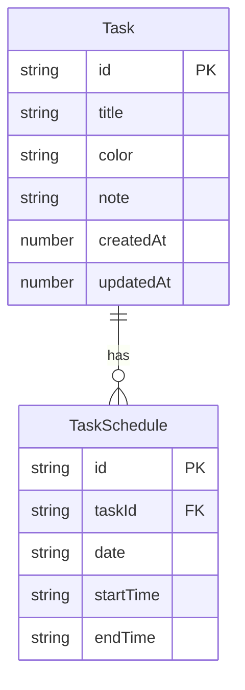

## 用户需求

当前一个任务只能在一天内显示，从任务列表拖入新天后，前一天的数据会被覆盖（移动）。用户要求：**一个任务可以出现在多个日期，每天的显示时间互相独立、可分别自定义**。

## 核心变更

将任务的时间安排从"单条记录内置日期+时间"改为"任务本体 + 多条独立日程"的两层模型：

- **Task（任务本体）**：仅保存标题、颜色、备注等不变属性
- **TaskSchedule（日程实例）**：每条记录对应"某天某时间段"，一个任务可拥有零到多条日程

## 行为要求

1. 任务列表中创建的任务无日程，标注"未计划"
2. 从任务列表拖入日历 = 创建该任务的日程实例（默认 1 小时）
3. 同一任务可多次拖入不同日期（含同一日期的多个时间段）
4. 日历视图内拖拽 = 修改该日程实例的时间/日期（不影响其他天）
5. 删除日程实例 = 仅移除那一天的出现，任务仍保留
6. 删除任务 = 移除任务及所有关联日程
7. 编辑任务本体 = 修改标题/颜色/备注，所有出现同步更新
8. 编辑日程实例 = 修改该天的具体时间

## 文件列表

- 已确认需要修改的文件：types、db、task store、drag store、drag composable、DayView、WeekView、MonthView、TaskList、TaskPanel、TaskSlider、DragPreview

## 技术栈

- Vue 3 Composition API + TypeScript
- Pinia 状态管理
- IndexedDB (idb 库) 持久化
- Tailwind CSS 样式
- HTML5 Drag & Drop + Pointer Events 拖拽

## 实现方案

### 数据模型重构

引入 Task + TaskSchedule 两层模型。Task 仅存不变属性，TaskSchedule 存日期+时间。Task 是 1:N 的父关系。

**关键决策：EditContext 模式**
用户点击日历中的日程实例时，TaskPanel 需要同时知道"哪个任务"和"哪个日程"来决定编辑范围。通过 `editingSchedule: TaskSchedule | null` 控制：有值时编辑日程时间，无值时仅编辑任务属性。编辑任务属性时关闭 hasTime 开关。

**关键决策：日历视图传递 schedule 数据**
TaskSlider 和 MonthView 任务标签需要 schedule 的 startTime/endTime 来渲染。DayView/WeekView/MonthView 获取的是 `TaskWithSchedule[]`（Task + 关联 Schedule），TaskSlider 的 `task` prop 不再包含时间字段。

### 性能

- 全量加载 tasks + schedules 到内存，所有查询为内存过滤（O(N)，N = 任务数，当前量级无性能瓶颈）
- DB 版本升级使用 `upgrade` 回调创建新 store，旧数据迁移为无日程任务

### 数据迁移

DB 版本从 1 升到 2。在 `upgrade` 回调中：遍历旧 `tasks` store 中有日期时间的记录，自动创建对应 TaskSchedule 记录，再清除旧记录的日期时间字段。

## 实现细节

### 数据库层

- DB_VERSION 升至 2
- 新增 `task-schedules` store，主键 `id`，索引 `taskId`、`date`、复合索引 `[taskId, date]`
- 新增 CRUD 方法：`createSchedule`, `getSchedulesByTaskId`, `getSchedulesByDate`, `updateSchedule`, `deleteSchedule`, `deleteSchedulesByTaskId`
- `upgrade` 回调中迁移旧数据

### 类型层

```typescript
interface Task {
  id: string; title: string; color: TaskColor;
  note?: string; createdAt: number; updatedAt: number;
}
interface TaskSchedule {
  id: string; taskId: string;
  date: string; startTime: string; endTime: string;
}
interface TaskWithSchedule {
  task: Task; schedule: TaskSchedule;
}
```

- `isTaskScheduled(taskId)` 替代 `isPlannedTask(task)`
- `CreateTaskParams` 移除日期时间字段
- `UpdateTaskParams` 拆分为 `UpdateTaskParams` 和 `UpdateScheduleParams`

### Store 层

- `schedules: ref<TaskSchedule[]>([])`
- `taskSchedules(taskId)` 返回该任务所有日程
- `getScheduleInstancesForDate(dateStr)` 返回 `TaskWithSchedule[]`（合并 task + schedule）
- `scheduleTaskOnDate(taskId, date, startTime, endTime)` 创建日程
- `updateSchedule(id, params)` / `removeSchedule(id)` / `removeAllSchedules(taskId)`
- `editingSchedule` ref 控制编辑上下文
- `openEditPanel(task, schedule?)` 区分编辑模式
- `deleteTask` 级联删除所有日程

### 视图层

- **DayView**：`currentTasks` 改为 `getScheduleInstancesForDate(dateStr)` 返回 `TaskWithSchedule[]`；TaskSlider 传入 schedule 的时间；drop 创建日程而非覆盖
- **WeekView**：同 DayView 逻辑，`getTasksForDate` 改为 `getScheduleInstancesForDate`
- **MonthView**：任务标签改用 schedule 数据渲染；拖拽移动创建/修改日程
- **TaskSlider**：接收 `TaskWithSchedule`，从 schedule 读取时间；resize 只修改当前 schedule；拖拽结束时用 `draggingScheduleId` 定位要更新的 schedule
- **DragPreview**：从 dragStore 读取 `draggingSchedule` 的时间
- **TaskList**：`isPlannedTask(task)` 改为 `isTaskScheduled(task.id)`
- **TaskPanel**：编辑任务属性时隐藏时间区域；编辑日程时显示时间输入

### 拖拽层

- dragStore 新增 `draggingScheduleId: ref<string | null>` 和 `draggingSchedule: computed`
- `startDrag` 接受可选 `scheduleId` 参数
- `startDragFromList` 无 scheduleId（从列表拖出的任务无日程）
- useDrag 的 `DragOptions.task` 改为 `DragOptions.taskWithSchedule`，同时传递 task + schedule

## 架构图



本次需求不涉及新 UI 组件创建，仅对现有组件做逻辑和数据结构调整，无需生成设计方案。