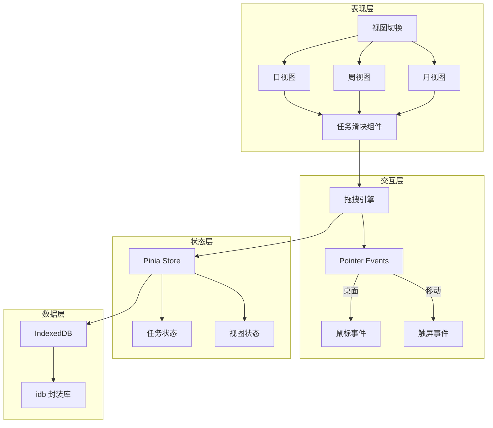

## 产品概述

yPlan 是一款基于滑块拖拽的日程管理应用，核心创新点是将任务以可拖拽的滑块形式嵌入日历时间轴上，用户可通过直观的拖拽操作调整任务时间段。

## 核心功能

### 视图系统

- **日视图**：24小时垂直时间轴，任务以横向滑块展示，支持拖拽调整
- **周视图**：7列日期 + 垂直时间轴，跨天任务可视化
- **月视图**：传统日历格子布局，任务以色块摘要显示

### 任务滑块交互

- 拖拽整体移动任务（改变开始时间）
- 拖拽边缘调整任务时长
- 最小时间粒度：15分钟
- 触屏与鼠标统一支持

### 任务管理

- 创建任务（标题、颜色、时间段、备注）
- 编辑任务详情
- 删除任务（带确认）
- 任务颜色分类

### 数据存储

- IndexedDB 本地持久化
- 支持大量任务数据
- 离线可用

## 技术栈

- **构建工具**: Vite 5.x（快速 HMR，现代构建）
- **前端框架**: Vue 3 + Composition API + TypeScript
- **状态管理**: Pinia（轻量，Vue 3 原生支持）
- **样式方案**: Tailwind CSS 3.x（响应式，快速开发）
- **路由**: Vue Router 4.x
- **数据存储**: IndexedDB + idb 库（Promise 封装）
- **日期处理**: dayjs（轻量，链式操作）

## 技术架构

### 系统架构图



### 核心模块划分

1. **视图模块**：日/周/月三种视图组件，共享时间轴渲染逻辑
2. **滑块模块**：可拖拽任务块，支持整体移动和边缘调整
3. **拖拽引擎**：基于 Pointer Events 统一处理鼠标/触屏
4. **存储模块**：IndexedDB CRUD 封装，自动同步状态

### 数据流设计

```
用户拖拽 → Pointer Events 捕获 → 计算新时间段 → 更新 Pinia Store → 持久化到 IndexedDB → 视图重渲染
```

## 实现要点

### 拖拽性能优化

- 使用 `requestAnimationFrame` 节流渲染
- 拖拽时禁用过渡动画，松开后恢复
- 任务数量超过 50 时启用虚拟滚动

### 响应式适配

- 断点：`md:768px` 区分移动端/桌面端
- 移动端：底部导航、手势滑动切换视图
- 桌面端：侧边栏任务面板、键盘快捷键

### IndexedDB 设计

- Store: `tasks`（主存储）
- 索引: `startDate`, `endDate`（范围查询优化）
- 自动迁移策略：版本号管理

## 设计风格

采用现代简约风格，以清晰的信息层级和流畅的交互动效为核心。使用 TDesign Vue Next 组件库作为基础，搭配 Tailwind CSS 定制化样式。

## 页面规划

### 1. 主页面（日历视图）

**顶部导航栏**

- 左侧：Logo + 应用名称
- 中间：日期选择器 + 视图切换按钮组（日/周/月）
- 右侧：今日按钮 + 新建任务按钮

**主体区域**

- 日视图：左侧时间刻度轴（00:00-24:00）+ 右侧任务滑块区
- 周视图：顶部日期标题 + 下方7列时间轴网格
- 月视图：6行7列日历格子，每个格子显示当日任务摘要

**底部导航栏（移动端）**

- 日视图 / 周视图 / 月视图 / 任务列表 四个 Tab

### 2. 任务编辑面板（抽屉/弹窗）

- 任务标题输入框
- 时间选择器（开始时间、结束时间）
- 颜色标签选择器
- 备注文本域
- 保存/删除按钮

## 交互设计

### 滑块拖拽

- 拖拽开始：滑块微微放大，显示时间提示气泡
- 拖拽中：实时更新位置，时间轴高亮目标时段
- 拖拽结束：平滑动画过渡，显示确认 Toast

### 视图切换

- 切换动画：淡入淡出 + 缩放过渡
- 保持当前选中的日期焦点