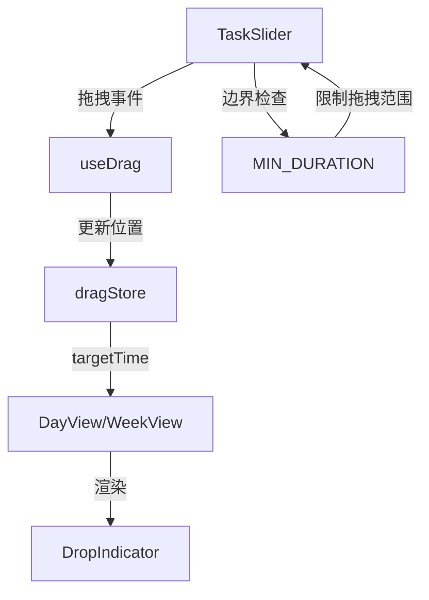

## 产品概述

为 yPlan 日程管理应用的拖拽功能添加边界判断和时间线预览功能。

## 核心功能

### 功能一：边界判断防止时间反转

- 调整开始时间时不能超过结束时间
- 调整结束时间时不能早于开始时间
- 任务持续时间至少 15 分钟
- 拖拽过程中实时限制拖拽范围

### 功能二：时间线指示器预览

- 在目标位置显示虚线横线指示器
- 显示新的开始时间标签
- 轻量、不遮挡内容
- 实时跟随拖拽位置更新

## 视觉效果

```
    跟随鼠标
        ↓
    ┌─────────┐
    │ 会议任务 │  ← DragPreview 跟随鼠标
    └─────────┘
        
    目标位置
        ↓
  ───────────────  ← 虚线横线
     09:30         ← 时间标签
```

## 技术栈

- Vue 3 + TypeScript
- Tailwind CSS
- Pinia 状态管理
- 现有工具函数：`calculateDuration`, `offsetTime`, `offsetToMinutes`, `pixelsToTime`

## 实现方案

### 第一部分：边界判断

#### 1. 添加最小持续时间常量

**文件**: `src/utils/constants.ts`

```typescript
export const MIN_DURATION = 15 // 最小任务持续时间（分钟）
```

#### 2. 修改 TaskSlider.vue

**onMove2D 函数修改**：在拖拽过程中限制拖拽范围

- **resize-start**: 计算最大允许的向上拖拽距离，限制不能超过边界
- **resize-end**: 计算最大允许的向下拖拽距离，限制不能超过边界
- **move**: 实时更新 dragStore.targetTime

**onEnd2D 函数修改**：最终验证并修正

#### 边界计算逻辑

```
resize-start（向上拖拽）:
  当前持续时间 = endTime - startTime
  最大向上拖拽分钟数 = 当前持续时间 - MIN_DURATION
  最大向上拖拽像素 = 最大向上拖拽分钟数 * (HOUR_HEIGHT / 60)
  
resize-end（向下拖拽）:
  当前持续时间 = endTime - startTime  
  最大向下拖拽像素 = -(当前持续时间 - MIN_DURATION) * (HOUR_HEIGHT / 60)
```

### 第二部分：时间线指示器

#### 1. 创建 DropIndicator 组件

**文件**: `src/components/common/DropIndicator.vue`

组件功能：

- 显示虚线横线（2px dashed，主色调，透明度 0.6）
- 显示时间标签（圆角背景，显示 HH:mm）
- 支持动画过渡效果

Props:

- `time`: 目标时间字符串 (HH:mm)
- `duration`: 任务持续时间（分钟）
- `dateIndex`: 周视图中的日期索引（可选）

#### 2. 修改 TaskSlider.vue

在 `onMove2D` 回调中实时更新 `dragStore.targetTime`：

- 计算当前拖拽位置对应的时间
- 调用 `dragStore.setTargetTime()` 更新

#### 3. 集成到 DayView 和 WeekView

- 监听 `dragStore.isDragging` 和 `dragStore.targetTime`
- 计算指示器位置
- 渲染 DropIndicator 组件

## 架构设计



## 数据流

1. 用户开始拖拽 → TaskSlider 调用 startDrag
2. 拖拽过程 → onMove2D 计算偏移量和目标时间
3. 边界验证 → 限制拖拽范围，更新 dragStore.targetTime
4. 视图响应 → DayView/WeekView 监听 dragStore 变化
5. 渲染指示器 → DropIndicator 显示在目标位置
6. 拖拽结束 → onEnd2D 最终验证并更新任务

## 目录结构

```
src/
├── utils/
│   └── constants.ts           # [MODIFY] 添加 MIN_DURATION 常量
├── components/
│   ├── common/
│   │   └── DropIndicator.vue  # [CREATE] 时间线指示器组件
│   ├── task/
│   │   └── TaskSlider.vue     # [MODIFY] 边界判断 + 实时更新 targetTime
│   └── calendar/
│       ├── DayView.vue        # [MODIFY] 集成 DropIndicator
│       └── WeekView.vue       # [MODIFY] 集成 DropIndicator
└── stores/
    └── drag.ts                # [MODIFY] 确保 targetTime 可用
```

## 关键代码结构

### DropIndicator.vue 组件结构

```
<script setup lang="ts">
defineProps<{
  time: string           // 目标时间 "09:30"
  duration: number       // 持续时间（分钟）
  dateIndex?: number     // 周视图日期索引
}>()

// 计算指示器 Y 位置
const yPosition = computed(() => {
  const [hour, min] = props.time.split(':').map(Number)
  return hour * HOUR_HEIGHT + (min / 60) * HOUR_HEIGHT
})
</script>

<template>
  <!-- 虚线 + 时间标签 -->
</template>
```

### TaskSlider.vue 修改点

```typescript
// onMove2D 中添加边界验证和 targetTime 更新
onMove2D: (offset, position) => {
  if (type === 'resize-start') {
    // 边界验证
    const maxOffset = calculateMaxOffset('resize-start')
    const clampedOffset = Math.max(offset.y, maxOffset)
    // 应用限制后的偏移
  }
  
  if (type === 'move') {
    // 实时计算目标时间
    const targetTime = calculateTargetTime(position)
    dragStore.setTargetTime(targetTime)
  }
}
```

## Agent Extensions

### SubAgent

- **code-explorer**
- Purpose: 探索现有拖拽相关代码实现细节，确保方案与现有架构一致
- Expected outcome: 获取 dragStore、DayView、WeekView 的完整实现细节