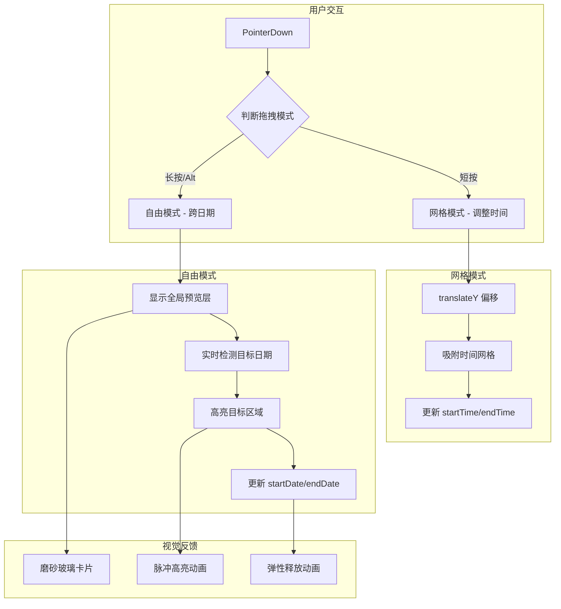

## 产品概述

为 yPlan 日程管理应用实现自由拖拽功能，允许任务在周/月视图中跨日期移动，提供流畅的视觉反馈和统一预览卡片。

## 核心功能

- **自由拖拽模式**：任务可脱离网格约束，随鼠标自由移动，不再受限于单一时间轴
- **统一拖拽预览**：拖动时显示固定尺寸(180x60px)的磨砂玻璃预览卡片，保持视觉一致性
- **跨日期拖动**：周视图中任务可跨越不同日期列移动，月视图中任务可拖拽到任意日期
- **智能模式切换**：短按拖动调整时间(网格模式)，长按/Alt键触发自由拖动
- **目标区域高亮**：实时检测目标日期并高亮显示，提供清晰的视觉反馈
- **弹性释放动画**：拖拽结束时苹果风格弹性动画，增强交互品质

## 技术栈

- **Vue 3 Composition API**：响应式状态管理、组合式函数
- **TypeScript**：类型安全的拖拽参数和状态定义
- **Tailwind CSS**：动态样式绑定、磨砂玻璃效果
- **dayjs**：日期计算和格式转换
- **Pointer Events API**：跨平台拖拽事件处理

## 实现方案

### 1. 拖拽系统架构



### 2. 核心技术决策

| 决策点 | 方案 | 理由 |
| --- | --- | --- |
| 拖拽事件 | Pointer Events API | 跨平台兼容，支持触摸和鼠标 |
| 预览层实现 | Teleport + position:fixed | 不影响原有布局，全局可访问 |
| 模式切换 | 长按检测(300ms) + Alt键 | 符合用户直觉，避免误触 |
| 日期检测 | getBoundingClientRect | 精确获取列/单元格位置 |
| 性能优化 | will-change + rAF | 减少重排，保证60fps |


### 3. 数据流设计

```typescript
// 拖拽状态接口
interface FreeDragState {
  isDragging: boolean
  taskId: string | null
  mode: 'grid' | 'free'
  startPosition: { x: number; y: number }
  currentPosition: { x: number; y: number }
  targetDate: string | null
  originalTask: Task | null
}
```

### 4. 性能优化策略

- **拖拽时禁用过渡**：`transition: none` 避免动画延迟
- **使用 transform**：GPU加速，避免触发重排
- **节流日期检测**：每帧最多检测一次目标日期
- **预览层独立渲染**：避免原组件频繁更新

## 目录结构

```
src/
├── composables/
│   ├── useDrag.ts              # [MODIFY] 扩展支持 2D 偏移
│   └── useFreeDrag.ts          # [NEW] 自由拖拽 composable
├── components/
│   ├── task/
│   │   ├── TaskSlider.vue      # [MODIFY] 支持自由拖拽模式
│   │   └── DragPreview.vue     # [NEW] 全局拖拽预览组件
│   └── calendar/
│       ├── WeekView.vue        # [MODIFY] 支持跨日期拖拽检测
│       ├── MonthView.vue       # [MODIFY] 支持任务拖拽移动
│       └── DayView.vue         # [MODIFY] 添加自由拖拽支持
├── stores/
│   └── drag.ts                 # [NEW] 拖拽状态全局 store
├── types/
│   └── index.ts                # [MODIFY] 添加拖拽类型定义
├── style.css                   # [MODIFY] 添加拖拽预览样式
└── App.vue                     # [MODIFY] 挂载全局预览层
```

## 实现细节

### useFreeDrag composable 核心逻辑

```typescript
// 1. 长按检测 (300ms 触发自由模式)
const longPressTimer = ref<number | null>(null)
const FREE_DRAG_THRESHOLD = 300 // ms

// 2. 目标日期检测
function detectTargetDate(clientX: number, columns: HTMLElement[]) {
  for (const col of columns) {
    const rect = col.getBoundingClientRect()
    if (clientX >= rect.left && clientX <= rect.right) {
      return col.dataset.date
    }
  }
  return null
}

// 3. 时间计算 (Y轴偏移 -> 分钟数)
function calculateTimeFromOffset(offsetY: number): string {
  const minutes = Math.round((offsetY / HOUR_HEIGHT) * 60 / 15) * 15
  return formatMinutes(minutes)
}
```

### DragPreview 组件

```
<!-- 全局拖拽预览层 -->
<Teleport to="body">
  <div
    v-if="dragStore.isDragging && dragStore.mode === 'free'"
    class="drag-preview fixed pointer-events-none z-[9999]"
    :style="{
      left: `${position.x}px`,
      top: `${position.y}px`,
    }"
  >
    <!-- 统一尺寸预览卡片 -->
    <div class="w-[180px] h-[60px] glass rounded-xl shadow-2xl p-3">
      <div class="text-sm font-medium truncate">{{ task?.title }}</div>
      <div class="text-xs text-gray-500">{{ targetDate }}</div>
    </div>
  </div>
</Teleport>
```

## 设计风格

延续苹果风格设计语言，为拖拽交互添加流畅的视觉反馈。

## 拖拽预览卡片设计

**尺寸规范**：

- 宽度：180px（统一尺寸，不随任务变化）
- 高度：60px（紧凑但足够显示信息）
- 圆角：12px（与整体设计一致）

**视觉效果**：

- 磨砂玻璃背景：`backdrop-blur-xl bg-white/80`
- 动态阴影：`shadow-2xl` 跟随移动
- 弹性缩放：拖拽时 `scale(1.05)`，释放时弹性回弹

## 目标区域高亮

```css
.drop-target-active {
  background: rgba(0, 82, 217, 0.08);
  border: 2px dashed #0052D9;
  animation: pulseTarget 1s ease-in-out infinite;
}

@keyframes pulseTarget {
  0%, 100% { background: rgba(0, 82, 217, 0.08); }
  50% { background: rgba(0, 82, 217, 0.15); }
}
```

## 交互状态

| 状态 | 视觉表现 |
| --- | --- |
| 默认 | 正常任务卡片 |
| 悬停 | 轻微放大(1.02) + 阴影扩散 |
| 拖拽中(网格) | 原地变形，吸附网格 |
| 拖拽中(自由) | 原卡片半透明，预览卡片跟随鼠标 |
| 目标高亮 | 目标区域虚线边框 + 脉冲背景 |
| 释放 | 弹性动画回归目标位置 |


## Agent Extensions

### SubAgent

- **code-explorer**
- Purpose: 深入探索代码库中的拖拽相关实现和事件处理逻辑
- Expected outcome: 确认所有需要修改的文件路径和现有模式